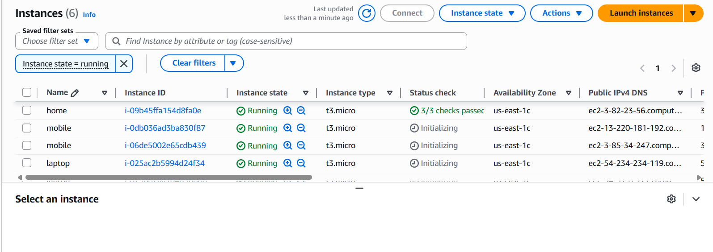
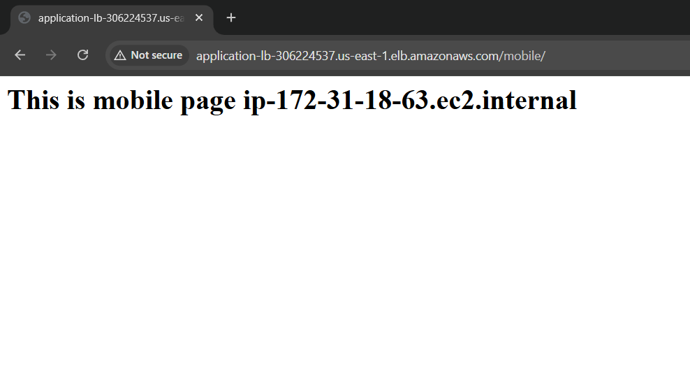
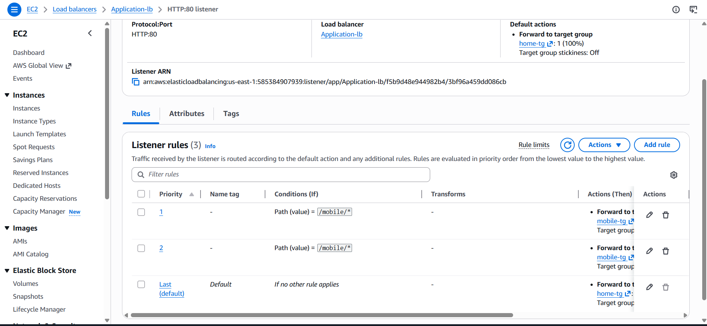
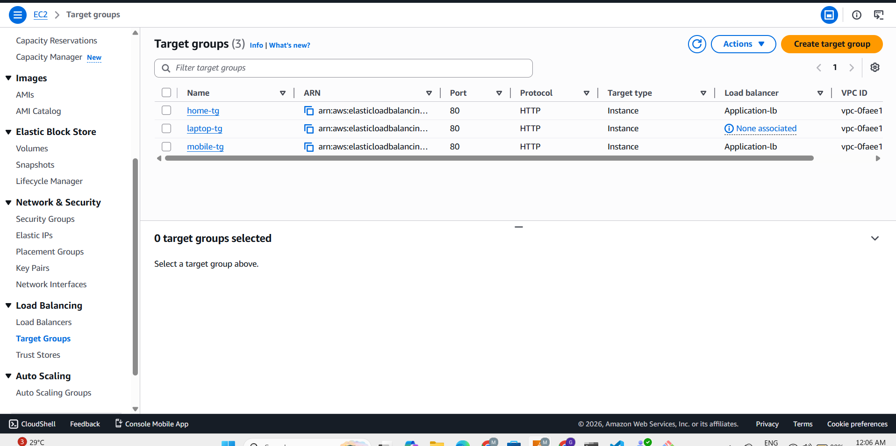

# AWS Application Load Balancer Project

---
# Introduction

This project demonstrates how to configure an AWS Application Load Balancer (ALB) with multiple EC2 instances and target groups.

Different applications are hosted on separate EC2 instances, and the Application Load Balancer routes traffic based on URL paths such as `/mobile` and `/laptop`.

This is an extended architecture project where multiple EC2 servers are attached to each service for better scalability and high availability.

The Application Load Balancer distributes incoming traffic between multiple servers using the Round Robin algorithm.

This project helps in understanding:
- AWS Load Balancer
- Target Groups
- Path-Based Routing
- Round Robin Technique
- EC2 Integration
- High Availability Architecture
- Traffic Distribution

---

# Architecture

```text
                    User Browser
                          │
                          ▼
             Application Load Balancer
                          │
        ┌─────────────────┼─────────────────┐
        │                 │                 │
        ▼                 ▼                 ▼

     Home TG          Mobile TG         Laptop TG
        │                 │                 │
   ┌────┴────┐       ┌────┴────┐       ┌────┴────┐
   ▼         ▼       ▼         ▼       ▼         ▼

 Home-1   Home-2   Mobile-1  Mobile-2 Laptop-1 Laptop-2
  EC2       EC2      EC2       EC2      EC2      EC2
```

---

# AWS Services Used

| Service | Purpose |
|---|---|
| EC2 | Hosting Applications |
| Application Load Balancer | Traffic Distribution |
| Target Groups | Route Requests |
| Security Groups | Allow HTTP Traffic |

---

# Project Structure

```text
AWS Cloud
│
├── Application Load Balancer
│
├── Target Groups
│   │
│   ├── home-tg
│   │     ├── home-server-1
│   │     └── home-server-2
│   │
│   ├── mobile-tg
│   │     ├── mobile-server-1
│   │     └── mobile-server-2
│   │
│   └── laptop-tg
│         ├── laptop-server-1
│         └── laptop-server-2
│
└── Listener Rules
      ├── /mobile/*
      ├── /laptop/*
      └── default → home-tg
```

---

# Step 1 — Launch EC2 Instances

Launch six EC2 instances:

| Service | Instances |
|---|---|
| Home | 2 EC2 Servers |
| Mobile | 2 EC2 Servers |
| Laptop | 2 EC2 Servers |

Use:
- Amazon Linux 2023
- t3.micro instance type

Allow ports:
- SSH → 22
- HTTP → 80

---

# Step 2 — Create Target Groups

Create three target groups:

| Target Group | EC2 Instances |
|---|---|
| home-tg | home-server-1, home-server-2 |
| mobile-tg | mobile-server-1, mobile-server-2 |
| laptop-tg | laptop-server-1, laptop-server-2 |

Protocol:
- HTTP

Port:
- 80

Target Type:
- Instance

---

# Step 3 — Create Application Load Balancer

Create an Application Load Balancer with:

- Internet Facing
- HTTP Listener on Port 80
- Attach all target groups

---

# Step 4 — Configure Listener Rules

Add path-based routing rules:

| Path | Target Group |
|---|---|
| /mobile/* | mobile-tg |
| /laptop/* | laptop-tg |
| Default | home-tg |

---

# Round Robin Technique

The Application Load Balancer uses the Round Robin algorithm to distribute incoming requests equally among multiple EC2 instances inside a target group.

Example:

- First request → home-server-1
- Second request → home-server-2
- Third request → home-server-1
- Fourth request → home-server-2

This technique helps in:
- Load Distribution
- Better Performance
- High Availability
- Reduced Server Load
- Improved Scalability

---

# Application URLs

## Home Page

```text
http://application-lb-dns-name/
```

---

## Mobile Page

```text
http://application-lb-dns-name/mobile/
```

---

## Laptop Page

```text
http://application-lb-dns-name/laptop/
```

---

# Screenshots

## EC2 Running Instances

[](img/ec2.png)
```

---
## Home Page Output
```

[](img/home.png)
```

## Mobile Page Output
```

[](img/mobile.png)
```
## Laptop Page Output
```

[](img/laptop.png)
```


## Load Balancer Listener Rules
```

[](img/lb-rules.png)
```
## Target Groups
```

[](img/tg.png)

---

# Security Group Configuration

| Type | Port |
|---|---|
| SSH | 22 |
| HTTP | 80 |

---

# Features

- Application Load Balancer
- Path-Based Routing
- Multiple EC2 Instances
- Round Robin Traffic Distribution
- High Availability
- Load Distribution
- Scalable Architecture
- Centralized Access

---

# Future Improvements

- HTTPS SSL Configuration
- Auto Scaling Group
- Route53 Domain Setup
- Jenkins CI/CD Integration
- Docker Deployment
- Monitoring using CloudWatch

---

# Author

## Nilesh Pradeep Patil

Fortune Cloud Technology
AWS & DevOps Engineering

---

# Summary

This project successfully demonstrates implementation of an AWS Application Load Balancer with multiple EC2 instances and target groups. Separate target groups were created for Home, Mobile, and Laptop services, with two EC2 servers attached to each group for high availability and scalability. The Application Load Balancer distributed traffic using path-based routing and the Round Robin technique, providing efficient traffic management and balanced server utilization in a cloud environment.

---